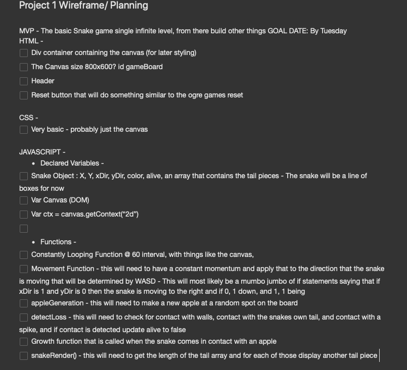
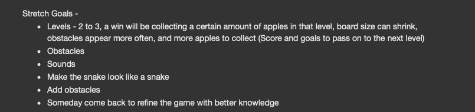

# Project-1-Snake Game #
## Introduction - ##
When presented with the requirements of this project the first idea that came to my mind and stuck with me throughout the planning stage was to recreate Snake. With this, I planned to add more to the game, like levels and obstacles along with goals to make level passing conditions. 
The technologies that I used are:
- HTML5
- Canvas
- CSS3
- Vanilla JavaScript


## Day 1 ##
    On day one my main goal was to make up a plan that was easy to fall back on when thinking of the different actions that my game
will have to do. Also in my plan was a good wireframe of the different parts to my code, this is a vital part to planning as it allows you to look back on it when needing to see what needs to do what and when. 
    Another big part of my planning stage was making a list of goals and stretch goals, which were goals that would not be included
in my base project. All in all my base project that I wanted to have done before moving onto making things in my list of stretch goals was just the base Snake game, which includes a snake that moves and eats, and when the snake eats he grows a little. The snake must avoid running into the walls or running into himself, both of which will end the game.
    One of the hardest parts of making the wireframe was the coming up with the logic for all of the different aspects. As you can
see below I started to make some designs on how the document would flow and how one function would lead to the next.

Also on day 1 I began coding, I was able to get the basic canvas drawn, the gameLoop function constructed, along with a few different functions and variables that I just made to somewhat structure the start of the logic. 



## Day 2 & 3 ##
    Day 2 was a very big day as far as progress goes, my goal was to try to get the MVP done by day 3. On day 2 I was faced with the
challenge of making most of the game logic including the growth function that I knew I would need to make. This was by far the most challenging part of the project so far because not only was I going to need to rewrite my movement function, but I was also going to need to make a new one that would apply to any tail pieces that would be added to the array. To solve this issue I first started using for loops to loop through all of the tail pieces and then moving them from inside of that loop, but there were problems with that at first where because of the names that I gave everything it was very wordy and confusing. Since then I was able to slim it down and have it make sense too. Below the move function there is the grow function which is pretty simple, it just adds an object to the array of tail parts, and increases the length counter I have.

```javascript
function move() {
for (let i = 0; i < snake.tail.length; i++) {
    ctx.fillStyle = "green";
    ctx.fillRect(snake.tail[i].x, snake.tail[i].y, 20, 20);
    //Check tail x and y's against the head piece
    if (snake.long > 3) {
    if (snake.tail[i].x == snake.x && snake.tail[i].y == snake.y) {
        snake.alive = false;
        topRight.textContent = 'Game Over! Press Space to restart';
    }
}
}
}

function grow() {
    snake.tail.push({x: snake.x, y: snake.y});
    snake.long++;
}
```

Other things that I was able to get working in the MVP version of my project are all of the game over conditions like running into walls and running into yourself, which you can see the logic to up above.

## Day 4 ##
    Massive amounts of progress were made this day due to having a good base design laid and planned out, I was able to get about
another 100 lines of logic made, moved all of the objects and variables to their own JS file, created multiple level objects so that I could check in the game loop what level I was on and display the blocks for that. By far the toughest thing today was creating more logic in my gameOver function so that the new levels had the correct collision detection based on where the obstacles were being formed. This was also the most impressive thing that I was able to accomplish today, and it wasn't all too bad when making it too. Here is the collision detection for the level that is made with random x and y coordinates along with a differing amount of obstacles based on the level that the player is on.
```javascript
    //Collision detection for randoLevel
if (currentLevel >= 4) {
    for (let i = 0; i < lvl4Arr.length; i++) {
        if (snake.x + 20 > lvl4Arr[i].x && snake.x < lvl4Arr[i].x + 20 && snake.y + 20 > lvl4Arr[i].y && snake.y < lvl4Arr[i].y + 20) {
            snake.alive = false;
            topRight.textContent = 'Game Over! Press Space to restart';
        }
    }
}
```
## Day 5 ##
    Today the focus for me was to style the site, however I also added other things like a very basic and mostly working level
selector using the keys L and K, and touch controls for when the screen size is less than 600px. After doing those things though I was able to stylize the website, mostly just changing around the colors and making things look decent. I also tested the game, and went through the levels for a while and by doing this I was able to find a few minor bugs, and went back and fixed those.

## Day 6 ##
    Today I was able to continue takling the challenge of adding sprites and animations that I had started yesterday. The biggest challenge was making the snake turn when it needed to be facing another direction. To solve this I ended up just making 4 separate head files and displaying them based on the direction that the snake was going to be facing. The apple was also interesting to make because I had to make it so loop through different sections of the spritesheet. In my case there was only 2 different sprites so I just made a simple if statement and a counter as seen below. Other than that I designed all of the sprites on make8bitart.com and put them into the game.
```javascript
    sprite: function() { // This code is inside of an object, and appleObj is a separate object with coordinates 
        if (this.count == 1) {
            ctx.drawImage(apples, appleObj.apple1.x, appleObj.apple1.y, 24, 24, this.x, this.y, 23, 23);
            this.count++;
        } else if (this.count == 2) {
            ctx.drawImage(apples, appleObj.apple2.x, appleObj.apple2.y, 24, 24, this.x, this.y + 1, 23, 23);
            this.count--;
        }
        
    }
```